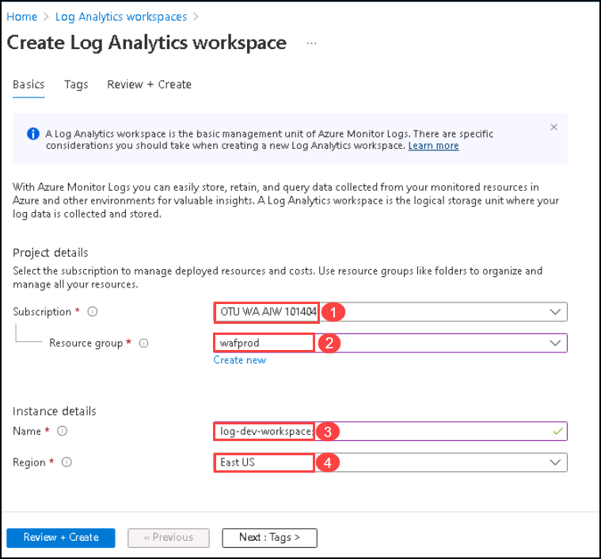
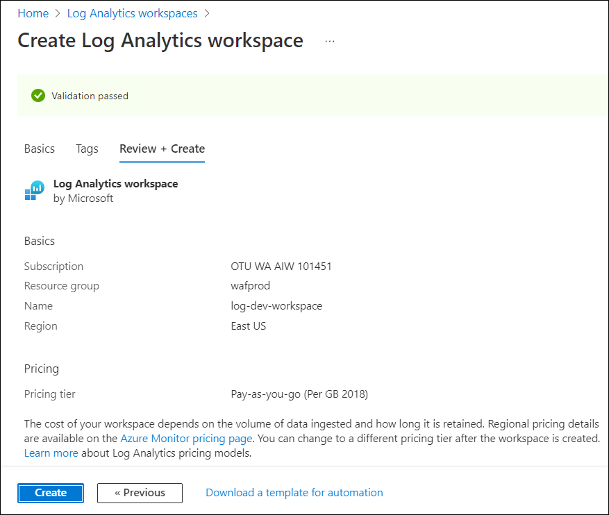
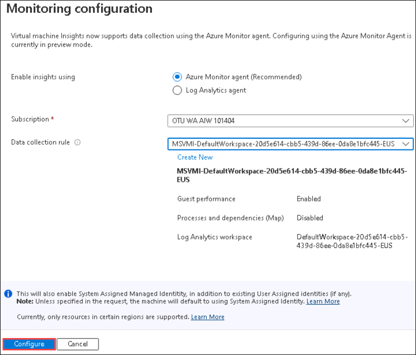

# Exercise 3: Performance-Efficiency

## Overview

Performance efficiency is the ability of your workload to scale to meet the demands placed on it by users in an efficient manner. Scaling correctly and using PaaS products with scaling built-in are two of the most effective strategies to achieve performance efficiency.

In this exercise, we will go through the given architecture and learn more about:

* Can you provide a solution that scales to meet the public demand? How would this solution change in a PaaS architecture?
* How can you improve the performance visibility and alerting? Are all the tiers covered?
* Is the architecture properly sized? Consider cost analysis to determine how much you can improve. 


### **Task 1: Design for scaling** 

A system's scalability refers to its ability to manage the increased load. Azure Autoscale-enabled services can scale automatically to meet demand and accommodate the workload. These systems automatically scale out to maintain capacity during workload peaks and then return to normal once the peak has passed.

Vertical scaling and horizontal scaling are the two basic ways an application can scale. Vertical scaling (scaling-up) enhances a resource's capacity, for example, by using a larger virtual machine (VM) size. Horizontal scaling (scaling out) refers to the addition of new instances of a resource, such as virtual machines or database replicas.

1. In the Azure portal, search for virtual machine scale sets and select **Virtual machine scale sets** from the suggestions.

   

2. Open the **srv** virtual machine scale set.

   

3. Choose **Scaling**, from the menu on the left-hand side and then select the button to Custom autoscale.

   

4. Select the option to **+ Add a rule**.

   

5. Add the rule by providing the following details:

* **Metric Source:** Select **Current resource (srv) (1)** from the drop down
* **Time aggregation:** Select **Average (2)**
* **Metric namespace:** Select **Virtual Machines Host (3)**
* **Metric name:** Select **Percentage CPU (4)**
* **Operator:** Select **Greater than (5)**
* **Metric threshold to trigger scale action:** Enter **70 (6)** %
* **Duration (minutes):** Enter **10 (7)**
* **Time graine statistic:** Select **Average (8)**
* **Operation:** Select **Increase count by (9)**
* **Cool down (minutes):** Enter **5 (10)**
* **Instance count:** Enter **1 (11)**
* At last, click on **Add (12)**

   

6. Click on **Add a rule** again. Leave all to default and modify the following details:

* **Operator:** Select **Less than (1)**
* **Metric threshold to trigger scale action:** Enter **30 (2)** %
* **Operation:** Select **Decrease percentage by (3)**
* Click on **Add (4)**

   

7. Set the following instance limits and select **Save**.

* **Minimum:** 1
* **Maximum:** 4
* **Default:** 2

   

8. To see the number and status of VM instances, select Instances from the menu on the left-hand side of the scale set window. The status indicates if the VM instance is Creating as the scale set automatically scales out, or is Deleting as the scale automatically scales in.


### **Task 2: Monitor performance**

In this task, we will use VM insights to monitor the performance and health of your virtual machines, including their running processes and dependencies on other resources. By locating performance bottlenecks and network problems, it can assist in ensuring the availability of critical applications and delivering predictable performance. It can also assist in determining whether a problem is connected to other dependencies.

The fact that VM Insights keeps its data in Azure Monitor Logs enables it to provide powerful aggregation and filtering as well as track data trends over time. Let's begin the process by creating a log analytics workspace.

1. In the Azure portal, search for log analytics workspaces and select **Log analytics workspaces** from the suggestions.

   

2. Click on **Create log analytics workspace**.

   

3. Provide the project and instance details as follows:

* **Subscription:** Make sure your subscription is selected **by default (1)**.
* **Resource group:** Select a resource group from the drop-down. Here we have selected **wafprod (2)**.
* **Name:** Give a name for the workspace **(3)**.
* **Region:** Select a region near to you, for example, **East US (4)**.
* Click on **Review + Create (5)**.

   

4. Review the details and click on **Create**.

   

5. Once the deployment succeeds, click on **Go to resource**.

   

6. From the left pane, select **Virtual machines (1)** present under _Workspace Data Sources_. Here you can see all the virtual machines and their status with respect to connectivity with the workspace.

   

7. Now we will connect the VMs with the log analytics workspace. Here, we will be working with the VMs that belong to the **wafprod** resource group. 

> **Note:** Before performing the next step, **make sure that all the VMs are in running state**, in the respective resource group.

8. Click on **wafproxxxxx** virtual machine to open it and click on **Connect**. Follow the same process for other VMs from the _wafprod_ resource group.

   

9. Return to the **Virtual Machines** tab from the menu in the left and observe the status of the VMs the _wafprod_ resource group. It should show up as **This workspace** under _Log Analytics Connection_.

   

   > **Note:** In case the status is not updated, click on the **Refresh** button to get the latest status.

10. In the Azure portal, click on the **Show portal menu (1)** button given in the top-left corner and then open **Monitor (2)**.

   

11. From the left pane, select **Virtual Machines** present under _Insights_ and then click on **Configure Insights**.

   

12. You will see your subscription and all the resource groups in it, listed here. Expand **wafprod** resource group and enable VM insights for all three VMs. Click on **Enable**.

   

13. On the **Get more visibility into the health and performance of your virtual machines** window, click on **Enable**. This will initiate the deployment of VM insights. Follow the same process for the other two VMs.

   
   
14. On the **Monitoring configuration** window, check **subscription** and click on **configure**

   

15. Return to the **Virtual Machines** tab from the menu on the left. Click on the **Refresh (1)** button and then observe the status of all three VMs. It should show up as **Enabling (2)** under _Monitor Coverage_.

   

   > **Note:** It will take up to 10 minutes for the data to reflect in Insights. To see the details, you can click on **Why?** and see the detailed message. Once done click on **Close (3)**.

16. VM insights include a set of performance charts that target several key performance indicators (KPIs) to help you determine how well a virtual machine is performing. To view that, open the **Virtual Machines** tab present in the left pane and click on **Performance**.

   

> **Note:** Insights may take up to 30 minutes to reflect in the dashboard. You can continue the lab and come back to view the insights.

16. In this section, you can play with filters such as **_Resource Group_** and **_Time Range_**. You will have graphical presentations for the following:

* **CPU Utilization % -** shows the top five machines with the highest average processor utilization.
* **Available Memory -** shows the top five machines with the lowest average amount of available memory.
* **Logical Disk Space Used % -** shows the top five machines with the highest average disk space used % across all disk volumes.
* **Bytes Sent Rate -** shows the top five machines with the highest average of bytes sent.
* **Bytes Receive Rate -** shows the top five machines with the highest average of bytes received.

   

17. Hover your cursor over the **CPU Utilization %** graph and you will be able to see CPU utilization for all three VMs that we enabled monitoring.

   


The graphs display resource use over time, so you can spot bottlenecks and anomalies. You may also switch to a perspective displaying each machine to see resource utilization according to the measure you've chosen. Although there are many factors to think about when it comes to performance, VM insights monitor important operating system performance indicators relating to the processor, memory, network adapter, and disk utilization.

Performance works hand in hand with the health monitoring capability to reveal problems that could point to a system component failure, support tuning, and optimization to increase efficiency or support capacity planning.


### **Task 3: Performance Testing**

Azure Load Testing Preview is a fully managed load-testing service that enables you to generate high-scale load. Regardless of where your applications are hosted, the service simulates traffic for them. It can be used by programmers, testers, and quality assurance (QA) engineers to enhance the speed, scalability, or capacity of applications.

Azure Load Testing is currently in preview because of which we have limited options available to it at the moment.

In this task, we will see how to load test a web application with Azure Load Testing Preview from the Azure portal without prior knowledge about load testing tools.

1. Firstly, you will create an Azure Load Testing resource. In the Azure portal, click on **Show portal menu (1)** and select **+Create a resource (2)**.

   

2. Search for Azure Load Testing in the search box and select **Azure Load Testing (Preview)** from the suggestions.
 
   

3. Select **Create** on the Azure Load Testing pane.
 
    

4. Provide the following information to configure the Load test:

 - **Subscription:** Make sure **your subscription (1)** is selected by default.
 - **Resource group:** Select **wafprod (2)** from the drop-down
 - **Name:** Give a name for the load test resource **(3)**.
 - **Location:** Leave to default **(4)**.
 - Click on **Review + create (5)**
 
    
    
    
5. Post the validation passes, click on **Create**.

    

6. Click on **Go to resource** to view the resource upon successful deployment.

    

7. Here, you will create a load test by using a sample web application URL.

8. On the **Overview** page, select **Quick test** given under _Load test your application and infrastructure_.

    

9. On the Quick test page, provide following details:

 - **Test URL:** As an example, enter **``` https://azure.microsoft.com ``` (1)**
 - Rest of the details are optional. Default values are already updated for all the asks.
 -  Click on **Run test (2)**. This will create and start the load test.

    

10. Once the load test begins, you will be directed to the test run dashboard. Azure Load Testing records both client-side and server-side metrics while the load test is underway. 

11. In the dashboard, you will see the client-side metrics in real-time while the test is running. The data refreshes every five seconds by default.

    

# Read-only tasks

### **Task 4: Application Insights**

Azure application insights is a part of  Azure monitor service. It is one of the powerful tools which can help to diagnose, monitor and analyze your application. It can help in identifying anomalies and monitoring the performances of applications deployed anywhere irrespective of their technology.  Azure application insights can monitor the application deployed on Azure as well as it can monitor the application which is deployed on on-premises.

For integrating the Azure Application Insights you need to install instrumentation package SDK (Standard development Kit) in your application. You can also integrate application insights just by enabling application insights agents if supported for your type of application.

Application Insights monitors:

* Request rates, response times, and failure rates.
* Dependency rates, response times, and failure rates, to show whether external services are slowing down performance.
* Analyze the aggregated statistics, or pick specific instances and drill into the stack trace and related requests. Application Insights reports both server and browser exceptions.
* Page views and load performance reported by users' browsers.
* User and session counts.
* Performance counters from Windows or Linux server machines, such as CPU, memory, and network usage
* Host diagnostics from Docker or Azure
* Diagnostic trace logs from apps, so you can correlate trace events with requests
* Custom events and metrics in client or server code that track business events, like items sold


Application Insights is an incredibly useful tool for anyone who has an application or website and wants to track and manage all the info that’s put out there – who’s viewing what, what’s the most popular, etc.

Application Insights is an application performance management service for web applications that enables you to do all the monitoring of your website performance in Azure. It’s designed to ensure you’re getting optimal performance and the best in class user experience from your website. It also has a powerful analytic tool that helps you diagnose issues and gain an understanding of how people are using your web application.

### **Task 5: SQL Insights**

SQL Insights is a remote, agent-based monitoring solution, which the Azure SQL and Azure Monitor teams at Microsoft developed in collaboration. The agent uses an open-source agent called Telegraf and supports SQL Server running on a Virtual Machine (VM), Azure SQL Database, and Azure SQL Managed Instances.

The agent runs on dedicated monitoring virtual machines to remotely collect data for SQL PaaS and SQL IaaS deployments. Furthermore, SQL Insights stores its data in Azure Monitor Logs (Workspace), allowing users to do aggregations, filtering, and data analysis. 

With SQL Insights, Azure customers will benefit from capabilities such as:

* Options to choose which data to collect 
* Control the retention policy for the data 
* Visualize data using Azure Monitor Workbooks
* Create separate Data Collection Rules for every environment 
* Integrate with open-source monitoring solutions (Telegraf) 
* Surface over two hundred new metrics

Azure customers will not incur costs for using SQL Insights directly. They will get charged for its activity in the Log Analytics workspace (data ingested from agents and stored in the workspace) and any alerts and notifications configured on the log data. The service is currently in preview for SQL Databases from version 2012 and up, SQL Managed Instance, and SQL Server on Azure Virtual Machines.


Now, click on the **Next** from lower right corner to move on next page.


